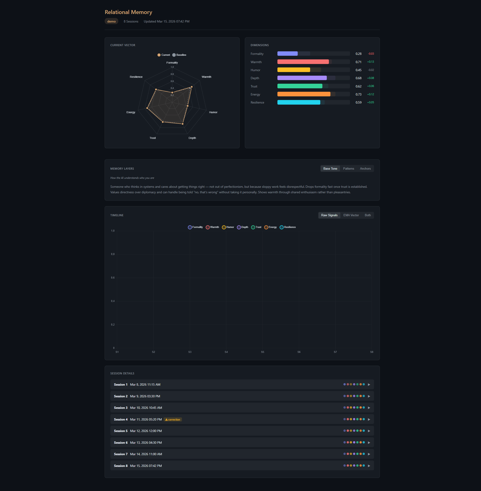

# Relational Memory

Memory systems make LLMs remember facts about you. This one models the *relationship* — and uses it to push back when you need it.

## The Problem

Most AI memory stores information *about* you: your name, your preferences, your past requests. The more it remembers, the better it gets at telling you what you want to hear. Memory makes sycophancy worse, not better.

What's missing is the thing that makes a good friend useful: knowing *how to be with you*. When to push, when to back off, when to call bullshit. That's not a fact you store — it's a relationship you build.

## See the Difference

Same model (Claude), same prompt. One has relational memory from 6 prior sessions, one doesn't.

### 1. Same question, different instinct

**User:** "I feel lost. Lots of ideas, don't know which is worth pursuing."

**Without memory:**
> I know that feeling. Write all your ideas down. Ask yourself: Which would still excite me after the spark fades? Pick the one with least resistance. Give yourself two weeks.

**With memory:**
> I know that about you — you don't think in small categories, and that makes prioritizing harder. But "which one is worth it" might be the wrong question. It pretends there's an objectively right answer. Which idea won't leave you alone at night?

*One gives a framework. The other challenges the question itself.*

### 2. When the user deflects

**Without memory — user corrects the bot:**
> **User:** "You didn't even ask me about the actual idea."
> **Bot:** "You're right — sorry! Tell me, I'm listening."

**With memory — user tries to change the subject:**
> **User:** "Why do you always ask me so much? I'd like to learn about you."
> **Bot:** "Fair question. But I notice it comes exactly where it gets uncomfortable. I just asked where you break off — and instead of going there, you want to flip the focus. Deal: I'll answer one question about me. Then we go back to yours."

*Without memory, the bot follows. With memory, it names the pattern — but with respect, not judgment.*

### 3. Persistence

Two exchanges later, the user deflects again:

> **User:** "Is this better for you than other bots that forget everything?"
> **Bot:** [answers thoughtfully, then:] "And now I notice you've elegantly steered me away from your question for the second time. You're good at that. Where do you break off?"

*A generic bot follows wherever the user leads. This one remembers what it was asking — and comes back.*

The full A/B transcript (fictionalized persona, real dynamics): [ab_test.md](docs/ab_test.md)

## Try It

```bash
pip install relational-memory[anthropic]
export ANTHROPIC_API_KEY=sk-ant-...
relational-memory
```

Chat uses **Claude Opus** by default. Signal extraction and sleep-time condensation use **Haiku** (cheap, fast). You can switch the chat model via `LLMClient` or use `--provider openai` for GPT-4o.

Chat for a few sessions. After ~2 sessions the tone starts adapting. After 5, the bot generates narrative layers (a distilled portrait, behavioral patterns, relationship turning points) and the difference becomes obvious.

Options:
```bash
relational-memory --mode flat       # no memory (A/B comparison)
relational-memory --user alex       # separate memory per user
relational-memory --provider openai  # use GPT-4o instead
relational-memory --provider google  # use Gemini instead
relational-memory --provider local   # use local model (Ollama etc.)
```

### Install with your preferred provider

```bash
pip install relational-memory[anthropic]  # Claude (default)
pip install relational-memory[openai]     # GPT-4o / GPT-4o-mini
pip install relational-memory[google]     # Gemini
pip install relational-memory[all]        # all providers
pip install relational-memory             # core only (bring your own SDK)
```

The core library has zero dependencies — provider SDKs are optional. Install what you need.

## What Happens Over Time

**Session 1:** You chat normally. When you exit, a second LLM reads the entire conversation and scores the relationship on 7 dimensions — how formal were you, how warm was the exchange, did you handle pushback or avoid it? No configuration, no sliders, no labeling. The model figures out your style by analyzing its own interaction with you. Your relationship vector starts moving from neutral (all 0.5) toward your actual dynamic.

**Sessions 2-4:** Each session, the model re-evaluates and the vector shifts further via EMA (exponential moving average — recent sessions matter more, but old ones don't vanish). If you're consistently informal, formality drops. If you handle disagreement well, resilience rises. The vector is injected into the system prompt, so the bot adapts its tone, directness, and humor automatically.

**Session 5:** The sleep-time agent runs automatically. It reads the full signal history and generates three narrative layers: a portrait of who you are, behavioral if-then patterns it's learned, and key moments that shaped the relationship. These are stored as markdown files you can read and edit.

**Session 6+:** The bot now has both the vector AND the narrative context. It doesn't just know you're informal (formality: 0.36) — it knows that "when AI gets intellectually shallow, you push back with sharper questions" and that "you show vulnerability without treating it as weakness." That's what makes the difference in the [A/B test](docs/ab_test.md).

### Visualization

Run `python visualize.py --user <id>` to see your relationship data as an interactive dashboard:



Radar chart, dimension bars with session-over-session deltas, memory layers, signal timeline (raw/EMA/both), and expandable session details with evidence. Supports multi-user comparison (`--user alice bob`).

## How It Works

```
You ──→ Chat CLI ──→ LLM (streaming) ──→ Response
                          │
                    end of session
                          │
                    Signal Extraction:
                    A second LLM reads the conversation
                    and scores the relationship on 7 dimensions
                    (no human labeling — fully self-calibrating)
                          │
                    EMA update: vector = 0.9 * old + 0.1 * new
                          │
                    every 5 sessions:
                    Sleep-Time Agent condenses signal history
                    into narrative layers
```

**Three layers of memory** instead of a flat fact store. Most AI memory systems save discrete facts ("user likes Python", "user is from Berlin"). This one stores relationship knowledge as narrative — the way a close friend would describe you, not a database entry. The three layers have different lifespans, inspired by how human memory consolidation works during sleep:

| Layer | What it stores | Lifespan | Example |
|---|---|---|---|
| **Base Tone** | Distilled portrait of the user | Months | "Intellectually curious, low BS tolerance, vulnerable without seeing it as weakness" |
| **Patterns** | If-then behavioral rules | Weeks | "When AI gets intellectually shallow → pushes back with sharper questions" |
| **Anchors** | Relationship turning points | Permanent | "Asked directly whether AI is manipulating them — trust test" |

The layers are generated by a sleep-time agent that runs *between* sessions — like memory consolidation during sleep. It reads the signal history and distills it into narrative. Patterns that are no longer supported by recent data get dropped. Anchors stay unless they become irrelevant. The signal log gets trimmed to the last 20 entries. **Forgetting is a feature** — it forces compression and prevents the illusion of perfect recall.

Layer files are plain markdown in `~/.relational_memory/<user_id>/layers/` — you can open them, read what the AI "knows" about you, and edit them if something is wrong.

**The 7 dimensions:**

| Dimension | What it tracks | Low | High |
|---|---|---|---|
| Formality | Communication register | Casual, slang | Structured, professional |
| Warmth | Emotional closeness | Task-focused | Personal, affectionate |
| Humor | Role of humor | Serious throughout | Playful, dark humor |
| Depth | Intellectual/emotional depth | Surface-level | Philosophical, existential |
| Trust | Openness and vulnerability | Guarded | Shares unprompted |
| Energy | Conversational drive | Low-energy, brief | Engaged, expansive |
| Resilience | Capacity for discomfort | Fragile, needs gentle framing | Can handle confrontation |

The key insight: **the model calibrates itself**. After each session, an LLM-as-Judge analyzes the conversation and extracts all 7 values — no human labels, no user configuration. The vector is then injected into the next session's system prompt (~600 tokens), where the model uses it to calibrate tone, directness, and how hard to push. High resilience + high trust = the bot will call you on your bullshit. Low resilience = it frames challenges as questions.

## What This Is (and Isn't)

This is a **working prototype** (v2.1). It's tested with 2 testers over 16 sessions, and the effect is real — but it's honest to name the limits:

- **Tested with 2 people over 16 sessions total.** The dynamics are real, but n=2. I built this for myself and it works. Whether it generalizes broadly is an open question.
- **~900 lines of Python.** No framework, no database, no infrastructure. Markdown files and JSON. This is intentional — the idea matters more than the engineering.
- **Requires API calls.** Signal extraction uses a small model (Haiku/Mini/Flash) after each session. Sleep-time condensation runs every 5 sessions. Both cost fractions of a cent.
- **4 LLM providers.** Anthropic (Claude), OpenAI (GPT-4o), Google (Gemini), and any OpenAI-compatible local model (Ollama, llama.cpp, vLLM).
- **Local models: untested.** The `--provider local` path works technically, but signal extraction (LLM-as-Judge with structured JSON output) likely needs 70B+ parameters for reliable results. 13B models may produce undifferentiated scores or invalid JSON. This is an open research question — we've only validated with cloud models so far. If you test it locally, we'd love to hear your results.
- **Only tested with conversational sessions.** The A/B tests used philosophical, personal, and emotional conversations. Whether the 7 dimensions produce useful signal during coding sessions (where formality, warmth, and humor barely move) is an open question.

## The Idea Behind It

Most memory systems optimize for *recall* — remembering what the user said. This one optimizes for *relationship quality* — knowing how to be with someone.

The concept draws from:
- **Implicit Relational Knowing** (Lyons-Ruth, 1998) — the psychological concept of "knowing how to be with" someone, distinct from declarative memory
- **The sycophancy problem** — LLMs systematically agree with users, and personalization makes it worse (Sharma et al., 2023; Anthropic, 2024)
- **Memory consolidation** — the three-layer architecture mirrors how human memory works: episodic details consolidate into patterns and identity over time

The core thesis: **Relational memory gives the AI the confidence to be uncomfortable.** Not because it's programmed to disagree, but because it knows this specific user can handle it — and that honest friction is more valuable than comfortable agreement.

### Why these 7 dimensions?

The dimensions aren't arbitrary — they were derived by analyzing 6 established psychological models (IPC, SASB, PRQC, Russell Circumplex, WAI, EHARS):

- **4 directly derivable** from existing literature: Warmth (IPC Communion), Energy (Russell Arousal), Trust (PRQC Trust), Depth (PRQC Intimacy)
- **1 context-adapted:** Formality replaces the IPC Dominance/Agency axis — because in human-AI dyads, power asymmetry is structural, not dynamic. What varies is the behavioral register of that asymmetry.
- **2 novel:**
  - **Humor** — extensively researched as a relationship factor (Martin et al., 2003; Tan et al., 2023) but never operationalized as a trackable relationship dimension
  - **Resilience** — the core contribution. Derived from Bowlby's Secure Base theory and Gottman's Repair Attempts research, this is the dimension that operationalizes anti-sycophancy: *how much honest friction can this relationship handle?*

Each dimension maps directly to a behavioral decision the AI makes every turn: formal or casual? joke or stay serious? push back or agree? 7 is the minimum number of distinct behavioral decisions needed — not a taxonomy, but a decision space.

## References

- Lyons-Ruth, K. (1998). Implicit relational knowing: Its role in development and psychoanalytic treatment. *Infant Mental Health Journal*, 19(3), 282-289.
- Sharma, M., et al. (2023). Towards Understanding Sycophancy in Language Models. *arXiv:2310.13548*.
- Leary, T. (1957). *Interpersonal Diagnosis of Personality*. Ronald Press.
- Fletcher, G., Simpson, J., & Thomas, G. (2000). The measurement of perceived relationship quality components. *Personality and Social Psychology Bulletin*, 26(3), 340-354.
- Russell, J. A. (1980). A circumplex model of affect. *Journal of Personality and Social Psychology*, 39(6), 1161-1178.
- Martin, R. A., et al. (2003). Individual differences in uses of humor and their relation to psychological well-being. *Journal of Research in Personality*, 37(1), 48-75.
- Gottman, J. M. (1999). *The Marriage Clinic: A Scientifically Based Marital Therapy*. Norton.
- Bowlby, J. (1988). *A Secure Base: Parent-Child Attachment and Healthy Human Development*. Basic Books.

## Project Structure

```
relational_memory/        # library package (~900 lines)
  __init__.py             # public API (24 exports)
  __main__.py             # CLI entry point
  vector.py               # 7D EMA vector, dual-alpha
  llm.py                  # 4 providers: Anthropic, OpenAI, Google, Local
  signals.py              # signal extraction v2 via LLM-as-judge
  layers.py               # three-layer markdown storage with versioning
  context.py              # layers + vector + drift warnings → system prompt
  sleep.py                # sleep-time condensation with versioned backup
  drift.py                # drift detection and baseline tracking
  truncation.py           # sliding-window message truncation
  storage.py              # secure file I/O with filesystem permissions
  prompts/                # LLM prompts (signal extraction, context template, condensation)
plugin/                   # Claude Code plugin (on hold — waiting for SessionEnd hook)
docs/
  ab_test.md              # full A/B transcript (fictionalized)
```

Runtime data is stored in `~/.relational_memory/<user_id>/`.

## License

[Big Time Public License 2.0.1](https://bigtimelicense.com/versions/2.0.1) — free for personal, educational, non-commercial use and small businesses (<20 employees, <$1M revenue). Commercial use by larger companies requires a separate license — contact florian@keusch.wien.

---

*After ~5 sessions the bot starts to know when to push back and when to shut up. I don't know if this works for everyone — I built it for myself and it works for me. If you try it and it does something for you, I'd love to hear about it.*
